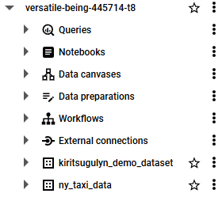
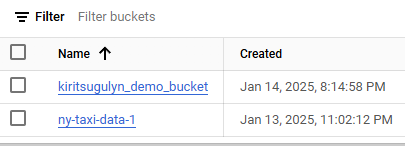
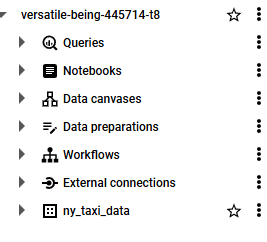

# Question 1 

Command:
docker run -it --entrypoint="bash" python:3.12.8
pip --version

Result:
pip 24.3.1 from /usr/local/lib/python3.12/site-packages/pip (python 3.12)

----------------------------------------------------------------------------------------------------
# Question 2 

----------------------------------------------------------------------------------------------------
# Question 3

SQL Query:
SELECT 1 idx, '<=1' distance, COUNT(*) counts FROM public.green_taxi_data
WHERE trip_distance <= 1 AND lpep_pickup_datetime >= '2019-10-01' AND lpep_dropoff_datetime < '2019-11-01'
UNION
SELECT 2 idx, '1-3' distance, COUNT(*) counts FROM public.green_taxi_data
WHERE trip_distance > 1 AND trip_distance <= 3 AND lpep_pickup_datetime >= '2019-10-01' AND lpep_dropoff_datetime < '2019-11-01'
UNION
SELECT 3 idx, '3-7' distance, COUNT(*) counts FROM public.green_taxi_data
WHERE trip_distance > 3 AND trip_distance <= 7 AND lpep_pickup_datetime >= '2019-10-01' AND lpep_dropoff_datetime < '2019-11-01'
UNION
SELECT 4 idx, '7-10' distance, COUNT(*) counts FROM public.green_taxi_data
WHERE trip_distance > 7 AND trip_distance <= 10 AND lpep_pickup_datetime >= '2019-10-01' AND lpep_dropoff_datetime < '2019-11-01'
UNION
SELECT 5 idx, '>10' distance, COUNT(*) counts FROM public.green_taxi_data
WHERE trip_distance > 10 AND lpep_pickup_datetime >= '2019-10-01' AND lpep_dropoff_datetime < '2019-11-01'
ORDER BY idx

Result:
"distance"	"counts"
"<=1"	104802
"1-3"	198924
"3-7"	109603
"7-10"	27678
">10"	35189

----------------------------------------------------------------------------------------------------
# Question 4

SQL Query:
SELECT DATE(lpep_pickup_datetime) pickup_date, MAX(trip_distance) max_trip_distance FROM public.green_taxi_data
GROUP BY pickup_date
ORDER BY max_trip_distance DESC
LIMIT 1

Result:
"pickup_date"	"max_trip_distance"
"2019-10-31"	515.89

----------------------------------------------------------------------------------------------------
# Question 5

SQL Query:
SELECT MIN(b."Zone")
FROM public.green_taxi_data a
JOIN public.zones b ON a."PULocationID" = b."LocationID"
WHERE DATE(lpep_pickup_datetime) = '2019-10-18'
GROUP BY a."PULocationID"
HAVING SUM(a.total_amount) > 13000

Result:
"East Harlem North"
"East Harlem South"
"Morningside Heights"

----------------------------------------------------------------------------------------------------
# Question 6

SQL Query:
SELECT c."Zone"
FROM public.green_taxi_data a
JOIN public.zones b ON a."PULocationID" = b."LocationID"
JOIN public.zones c ON a."DOLocationID" = c."LocationID"
WHERE b."Zone" = 'East Harlem North'
AND a.tip_amount = (
	SELECT MAX(public.green_taxi_data.tip_amount)
	FROM public.green_taxi_data
	JOIN public.zones ON public.green_taxi_data."PULocationID" = public.zones."LocationID"
	WHERE public.zones."Zone" = 'East Harlem North' 
)

Result:
"East New York"

----------------------------------------------------------------------------------------------------
# Question 7

Commands:
terraform init
terraform apply -auto-approve

terraform destroy

