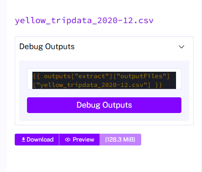
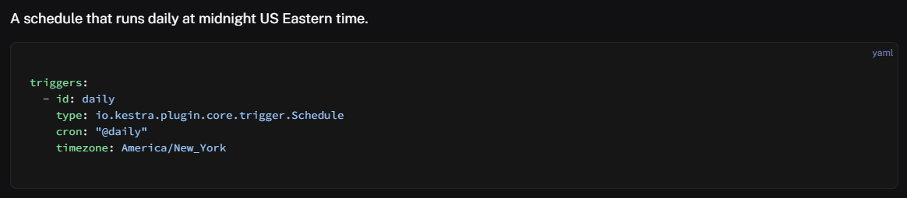

# Question 1

----------------------------------------------------
# Question 2

----------------------------------------------------
# Question 3
SELECT COUNT(*)
FROM public.yellow_tripdata
WHERE filename LIKE '%2020%'

24648499

----------------------------------------------------
# Question 4
SELECT COUNT(*)
FROM public.green_tripdata
WHERE filename LIKE '%2020%'

1734051

----------------------------------------------------
# Question 5

Tried 3 times: 195, 194, 195

----------------------------------------------------
# Question 6

https://kestra.io/docs/workflow-components/triggers/schedule-trigger
