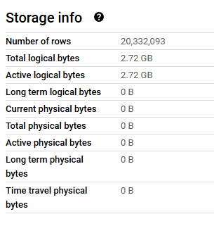

# Question 1 

----------------------------------------------------------------------------------------------------
# Question 2 

-- Estimated = 0B
SELECT COUNT(DISTINCT PULocationID) FROM de_zoomcamp_homework_week_3.external_yellow_tripdata;

-- Estimated = 155.12MB
SELECT COUNT(DISTINCT PULocationID) FROM de_zoomcamp_homework_week_3.yellow_tripdata_non_partitioned;

----------------------------------------------------------------------------------------------------
# Question 3 

-- Estimated = 155.12MB
SELECT PULocationID FROM de_zoomcamp_homework_week_3.yellow_tripdata_non_partitioned;

-- Estimated = 310.24MB
SELECT PULocationID, DOLocationID FROM de_zoomcamp_homework_week_3.yellow_tripdata_non_partitioned;

BigQuery is a columnar database, and it only scans the specific columns requested in the query. Querying two columns (PULocationID, DOLocationID) requires reading more data than querying one column (PULocationID), leading to a higher estimated number of bytes processed.

----------------------------------------------------------------------------------------------------
# Question 4

-- Result = 8333
SELECT COUNT(1) FROM de_zoomcamp_homework_week_3.yellow_tripdata_non_partitioned WHERE fare_amount = 0;

----------------------------------------------------------------------------------------------------
# Question 5

CREATE OR REPLACE TABLE de_zoomcamp_homework_week_3.yellow_tripdata_partitioned_clustered
PARTITION BY DATE(tpep_dropoff_datetime)
CLUSTER BY VendorID AS
SELECT * FROM de_zoomcamp_homework_week_3.external_yellow_tripdata;

----------------------------------------------------------------------------------------------------
# Question 6

-- Bytes processed = 310.24 MB
SELECT DISTINCT(VendorID) FROM de_zoomcamp_homework_week_3.yellow_tripdata_non_partitioned WHERE DATE(tpep_dropoff_datetime) BETWEEN '2024-03-01' AND '2024-03-15';

-- Bytes processed = 26.84 MB
SELECT DISTINCT(VendorID) FROM de_zoomcamp_homework_week_3.yellow_tripdata_partitioned_clustered WHERE DATE(tpep_dropoff_datetime) BETWEEN '2024-03-01' AND '2024-03-15';

----------------------------------------------------------------------------------------------------
# Question 7

GCP Bucket

----------------------------------------------------------------------------------------------------
# Question 8

False